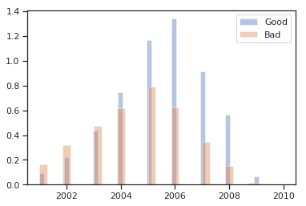

```python
%matplotlib inline

import numpy as np
import pandas as pd
import seaborn as sns
import matplotlib.pyplot as plt
sns.set(style="ticks", color_codes=True)

import warnings
warnings.filterwarnings('ignore')
```


```python
# NOTE: VNZIP1, BYRNO, WheelTypeID look like integers but should be treated like strings
df = pd.read_csv('Downloads/DontGetKicked/training.csv', index_col='RefId',
                 dtype={'VNZIP1':str, 'BYRNO':str, 'WheelTypeID':str},
                 parse_dates=['PurchDate'])
df.shape
```


    (72983, 33)


```python
# df.describe()
```


```python
df.head()
```


<div>
<style scoped>
    .dataframe tbody tr th:only-of-type {
        vertical-align: middle;
    }

    .dataframe tbody tr th {
        vertical-align: top;
    }

    .dataframe thead th {
        text-align: right;
    }
</style>
<table border="1" class="dataframe">
  <thead>
    <tr style="text-align: right;">
      <th></th>
      <th>IsBadBuy</th>
      <th>PurchDate</th>
      <th>Auction</th>
      <th>VehYear</th>
      <th>VehicleAge</th>
      <th>Make</th>
      <th>Trim</th>
      <th>Color</th>
      <th>Transmission</th>
      <th>WheelType</th>
      <th>...</th>
      <th>Model4</th>
      <th>Model5</th>
      <th>Model6</th>
      <th>SubModel0</th>
      <th>SubModel1</th>
      <th>SubModel2</th>
      <th>SubModel3</th>
      <th>SubModel4</th>
      <th>SubModel5</th>
      <th>SubModel6</th>
    </tr>
    <tr>
      <th>RefId</th>
      <th></th>
      <th></th>
      <th></th>
      <th></th>
      <th></th>
      <th></th>
      <th></th>
      <th></th>
      <th></th>
      <th></th>
      <th></th>
      <th></th>
      <th></th>
      <th></th>
      <th></th>
      <th></th>
      <th></th>
      <th></th>
      <th></th>
      <th></th>
      <th></th>
    </tr>
  </thead>
  <tbody>
    <tr>
      <th>1</th>
      <td>0</td>
      <td>2009-12-07</td>
      <td>ADESA</td>
      <td>2006</td>
      <td>3</td>
      <td>MAZDA</td>
      <td>i</td>
      <td>RED</td>
      <td>AUTO</td>
      <td>Alloy</td>
      <td>...</td>
      <td>None</td>
      <td>None</td>
      <td>None</td>
      <td>4D</td>
      <td>SEDAN</td>
      <td>I</td>
      <td>None</td>
      <td>None</td>
      <td>None</td>
      <td>None</td>
    </tr>
    <tr>
      <th>2</th>
      <td>0</td>
      <td>2009-12-07</td>
      <td>ADESA</td>
      <td>2004</td>
      <td>5</td>
      <td>DODGE</td>
      <td>ST</td>
      <td>WHITE</td>
      <td>AUTO</td>
      <td>Alloy</td>
      <td>...</td>
      <td>None</td>
      <td>None</td>
      <td>None</td>
      <td>QUAD</td>
      <td>CAB</td>
      <td>4.7L</td>
      <td>SLT</td>
      <td>None</td>
      <td>None</td>
      <td>None</td>
    </tr>
    <tr>
      <th>3</th>
      <td>0</td>
      <td>2009-12-07</td>
      <td>ADESA</td>
      <td>2005</td>
      <td>4</td>
      <td>DODGE</td>
      <td>SXT</td>
      <td>MAROON</td>
      <td>AUTO</td>
      <td>Covers</td>
      <td>...</td>
      <td>None</td>
      <td>None</td>
      <td>None</td>
      <td>4D</td>
      <td>SEDAN</td>
      <td>SXT</td>
      <td>FFV</td>
      <td>None</td>
      <td>None</td>
      <td>None</td>
    </tr>
    <tr>
      <th>4</th>
      <td>0</td>
      <td>2009-12-07</td>
      <td>ADESA</td>
      <td>2004</td>
      <td>5</td>
      <td>DODGE</td>
      <td>SXT</td>
      <td>SILVER</td>
      <td>AUTO</td>
      <td>Alloy</td>
      <td>...</td>
      <td>None</td>
      <td>None</td>
      <td>None</td>
      <td>4D</td>
      <td>SEDAN</td>
      <td>None</td>
      <td>None</td>
      <td>None</td>
      <td>None</td>
      <td>None</td>
    </tr>
    <tr>
      <th>5</th>
      <td>0</td>
      <td>2009-12-07</td>
      <td>ADESA</td>
      <td>2005</td>
      <td>4</td>
      <td>FORD</td>
      <td>ZX3</td>
      <td>SILVER</td>
      <td>MANUAL</td>
      <td>Covers</td>
      <td>...</td>
      <td>None</td>
      <td>None</td>
      <td>None</td>
      <td>2D</td>
      <td>COUPE</td>
      <td>ZX3</td>
      <td>None</td>
      <td>None</td>
      <td>None</td>
      <td>None</td>
    </tr>
  </tbody>
</table>
<p>5 rows × 44 columns</p>
</div>


# Class imbalance
First thing to notice is that there are many more examples of Good Buys than Bad ones. This is called class imbalance in classification problems and is important to keep in mind. It means that, if we were to pick a car at random, most likely than not the car would be Good. Specifically, a _dumb_ model that predicts all cars to be good, would be right around 88% of the times. This model would perform much better than a simple coin-toss, for example.

The reason that this is bad for learning, is that the models would be much more penalized for incorrectly labeling a good buy as bad, than the other way around. There are different ways to deal with this (e.g. up/down-sampling or weighting the cost function) and we'll consider them later.


```python
print(df.IsBadBuy.mean())
df.IsBadBuy.value_counts()
```

    0.12298754504473644


    0    64007
    1     8976
    Name: IsBadBuy, dtype: int64


## First model: label all cars Good. Accuracy = 88%
That would be our baseline if we don't correct for class imbalance


```python
from sklearn.metrics import accuracy_score

y_true, y_pred = df.IsBadBuy, [0]*len(df)
accuracy_score(y_true, y_pred)
```


    0.8770124549552636


### Accuracy of random model (coin-toss): 50%


```python
y_true, y_pred = df.IsBadBuy, np.random.randint(2, size=len(df))
accuracy_score(y_true, y_pred)
```


    0.5006645383171423


# Is there any discriminatory signal?
One of the first things to do is to see if we have any signal that could help differentiate between Good and Bad Buys. The quickest way to do that with numerical columns is just to compute the mean for each category (Good and Bad).

We can see that that there is some signal: `Bad Buys` are, on average, older, have more miles, cheaper, and have costlier warranties. These variables probably correlate with each other as well. For example, `VehicleAge` should yield the same information as `VehYear`; older cars usually have more miles on them, are cheaper to buy, and costlier to maintain/guarantee.

We learned two things:
1. The problem might be solvable: we already found some signal without any feature engineering or data cleaning
2. Linear models might have a problem with the collinearity of some features if we don't account for that (e.g. feature selection/dimensionality reduction)


```python
num_cols = ['VehicleAge', 'VehYear', 'VehOdo', 'MMRAcquisitionAuctionAveragePrice', 'WarrantyCost']
df.groupby('IsBadBuy')[num_cols].mean()
```


<div>
<style scoped>
    .dataframe tbody tr th:only-of-type {
        vertical-align: middle;
    }

    .dataframe tbody tr th {
        vertical-align: top;
    }

    .dataframe thead th {
        text-align: right;
    }
</style>
<table border="1" class="dataframe">
  <thead>
    <tr style="text-align: right;">
      <th></th>
      <th>VehicleAge</th>
      <th>VehYear</th>
      <th>VehOdo</th>
      <th>MMRAcquisitionAuctionAveragePrice</th>
      <th>WarrantyCost</th>
    </tr>
    <tr>
      <th>IsBadBuy</th>
      <th></th>
      <th></th>
      <th></th>
      <th></th>
      <th></th>
    </tr>
  </thead>
  <tbody>
    <tr>
      <th>0</th>
      <td>4.069461</td>
      <td>2005.446061</td>
      <td>71049.260362</td>
      <td>6229.642913</td>
      <td>1264.848173</td>
    </tr>
    <tr>
      <th>1</th>
      <td>4.940954</td>
      <td>2004.608512</td>
      <td>74714.148173</td>
      <td>5410.697604</td>
      <td>1360.246546</td>
    </tr>
  </tbody>
</table>
</div>


Going beyond the mean, we can also look at the distribution of some of these variables, and compare Good vs. Bad.

For `VehYear`, for example, we can see that 2003 and earlier models are more likely to be Bad buys than Good, and the opposite is true for 2004 or later.


```python
sns.distplot(df[['VehYear']][df.IsBadBuy == 0], kde=False, norm_hist=True, label='Good')
ax = sns.distplot(df[['VehYear']][df.IsBadBuy == 1], kde=False, norm_hist=True, label='Bad')
ax.legend();
```





The same (opposite) is true for `VehicleAge` (although the signal seems even better, for some reason..)


```python
sns.distplot(df[['VehicleAge']][df.IsBadBuy == 0], kde=False, norm_hist=True, label='Good')
ax = sns.distplot(df[['VehicleAge']][df.IsBadBuy == 1], kde=False, norm_hist=True, label='Bad')
ax.legend();
```


## Second model: label all cars 4 years or younger Good
This is another _not so smart_, threshold model, using just one feature. For us to be able to correctly estimate its accuracy, we need to correct for the class imbalance, i.e., we want the baseline accuracy to be 50%, not 88% as we saw above. The easiest way to do that is to down sample the Good labels to the same size as the Bad ones.


```python
from sklearn.utils import resample

def downsample(df):
    """Helper function to downsample majority class
    
    From https://elitedatascience.com/imbalanced-classes
    """

    # Separate majority and minority classes
    df_majority = df[df.IsBadBuy==0]
    df_minority = df[df.IsBadBuy==1]

    # Downsample majority class
    n = len(df_minority)
    df_majority_downsampled = resample(df_majority, 
                                       replace=False,    # sample without replacement
                                       n_samples=n,      # to match minority class
                                       random_state=123) # reproducible results

    # Combine minority class with downsampled majority class
    return pd.concat([df_majority_downsampled, df_minority])

df_downsampled = downsample(df)

# Display new class counts
df_downsampled.IsBadBuy.value_counts()
```


    1    8976
    0    8976
    Name: IsBadBuy, dtype: int64


### Accuracy of our `VehicleAge > 4` model: 60%
Better than random.


```python
for age in np.sort(df.VehicleAge.unique()):
    y_true, y_pred = df_downsampled.IsBadBuy, df_downsampled.VehicleAge > age
    print (age, accuracy_score(y_true, y_pred))
```

    0 0.5
    1 0.5174910873440285
    2 0.5457330659536542
    3 0.5905748663101604
    4 0.6038324420677362
    5 0.5832219251336899
    6 0.5544229055258467
    7 0.5272393048128342
    8 0.5072972370766489
    9 0.5


## Continuous variables
Some variables are actually continuous (as opposed to `VehicleAge`, for example, which just takes values from a small set of integers), and we can have more rich representations of their variation.

One thing to note is that, although Bad Buys have lower acquisition price on average, they have a wider distribution of prices and more outliers.


```python
sns.distplot(df[['MMRAcquisitionAuctionAveragePrice']][df.IsBadBuy == 0].dropna(), label='Good')
ax = sns.distplot(df[['MMRAcquisitionAuctionAveragePrice']][df.IsBadBuy == 1].dropna(), label='Bad')
ax.legend();
```


```python
sns.catplot(x="IsBadBuy", y="MMRAcquisitionAuctionAveragePrice", kind="box", data=df);
```


## Feature interaction
We can, of course, study if the above results depend on other features. We can see that the fact that auction price is lower on average for bad buys holds independently of car make (as given by `TopThreeAmericanName`)


```python
sns.catplot(x="IsBadBuy", y="MMRAcquisitionAuctionAveragePrice", kind="box", hue="TopThreeAmericanName", data=df);
```


And it also seems independent of the `Auction` provider (in direction or sign of the correlation; the actual strength of the correlation/signal may be stronger for some Auctions or Makes than others)


```python
sns.catplot(x="IsBadBuy", y="MMRAcquisitionAuctionAveragePrice", kind="box", col="Auction", data=df);
```


## Feature collinearity
Like we mentioned above, a lot of the features are probably correlated between themselves. For example, all the `Price` columns are highly correlated between each other


```python
df.corr().MMRAcquisitionAuctionAveragePrice.sort_values(ascending=False)
```


    MMRAcquisitionAuctionAveragePrice    1.000000
    MMRAcquisitionAuctionCleanPrice      0.990347
    MMRCurrentAuctionAveragePrice        0.937817
    MMRCurrentAuctionCleanPrice          0.932492
    MMRAcquisitionRetailAveragePrice     0.910391
    MMRAcquisitonRetailCleanPrice        0.910187
    MMRCurrentRetailAveragePrice         0.871755
    MMRCurrentRetailCleanPrice           0.871042
    VehBCost                             0.789840
    VehYear                              0.581146
    IsOnlineSale                         0.038818
    VehOdo                              -0.017022
    WarrantyCost                        -0.050417
    IsBadBuy                            -0.109252
    VehicleAge                          -0.565690
    Name: MMRAcquisitionAuctionAveragePrice, dtype: float64


We can also see that visually:

**WARNING: slow!**


```python
# sns.pairplot(df.iloc[:,df.columns.str.endswith('Price')])
```


    <seaborn.axisgrid.PairGrid at 0x10742ac88>


We also mentioned above that `VehYear` and `VehicleAge` are, of course, highly correlated and mostly represent the same thing. The same is probably also true for `WheelType` and `WheelTypeID`. We might just drop one of these before we model.


```python
df[['VehYear', 'VehicleAge']].corr()
```


<div>
<style scoped>
    .dataframe tbody tr th:only-of-type {
        vertical-align: middle;
    }

    .dataframe tbody tr th {
        vertical-align: top;
    }

    .dataframe thead th {
        text-align: right;
    }
</style>
<table border="1" class="dataframe">
  <thead>
    <tr style="text-align: right;">
      <th></th>
      <th>VehYear</th>
      <th>VehicleAge</th>
    </tr>
  </thead>
  <tbody>
    <tr>
      <th>VehYear</th>
      <td>1.000000</td>
      <td>-0.957957</td>
    </tr>
    <tr>
      <th>VehicleAge</th>
      <td>-0.957957</td>
      <td>1.000000</td>
    </tr>
  </tbody>
</table>
</div>


Liner correlations are also useful for _feature importance_, where we try to quickly see what features are better predictors of a `Bad Buy`. We've seen most of these features above: `VehicleAge`, `VehYear`, `MMRAcquisitionAuctionAveragePrice` and all other `Price` columns, `VehOdo`, and even `WarrantyCost`. We'll do more serious feature selection below, in the modeling section.


```python
df.corr().IsBadBuy.sort_values(ascending=False)
```


    IsBadBuy                             1.000000
    VehicleAge                           0.167164
    VehOdo                               0.082560
    WarrantyCost                         0.052319
    IsOnlineSale                        -0.003697
    MMRAcquisitonRetailCleanPrice       -0.083665
    MMRAcquisitionRetailAveragePrice    -0.087418
    VehBCost                            -0.099911
    MMRCurrentRetailCleanPrice          -0.100245
    MMRAcquisitionAuctionCleanPrice     -0.102954
    MMRCurrentRetailAveragePrice        -0.103914
    MMRCurrentAuctionCleanPrice         -0.104020
    MMRCurrentAuctionAveragePrice       -0.109112
    MMRAcquisitionAuctionAveragePrice   -0.109252
    VehYear                             -0.158886
    Name: IsBadBuy, dtype: float64


# Categorical features
Up until now we only looked at numerical features. There's also a lot of categorial ones (e.g. string/object type in pandas)


```python
df.dtypes.sort_values(ascending=False)
```


    TopThreeAmericanName                         object
    Size                                         object
    Model                                        object
    Trim                                         object
    SubModel                                     object
    Color                                        object
    Transmission                                 object
    WheelTypeID                                  object
    WheelType                                    object
    Auction                                      object
    Nationality                                  object
    Make                                         object
    PRIMEUNIT                                    object
    AUCGUART                                     object
    BYRNO                                        object
    VNZIP1                                       object
    VNST                                         object
    MMRAcquisitonRetailCleanPrice               float64
    MMRAcquisitionRetailAveragePrice            float64
    MMRAcquisitionAuctionAveragePrice           float64
    VehYear                                       int64
    PurchDate                            datetime64[ns]
    MMRCurrentAuctionAveragePrice               float64
    MMRCurrentAuctionCleanPrice                 float64
    MMRCurrentRetailAveragePrice                float64
    MMRCurrentRetailCleanPrice                  float64
    VehBCost                                    float64
    MMRAcquisitionAuctionCleanPrice             float64
    WarrantyCost                                  int64
    VehicleAge                                    int64
    VehOdo                                        int64
    IsOnlineSale                                  int64
    IsBadBuy                                      int64
    dtype: object


We need to encode these categorical features as numbers. There's multiple ways to do that, the simplest one being adding an indicator variable for each category. The pandas library has a very simple method to do this, called [pd.get_dummies](https://pandas.pydata.org/pandas-docs/stable/generated/pandas.get_dummies.html). It's simple, but we compromise on sparsity. Namely, it will aggressively expand the number of features, which can be problematic (e.g. overfitting, speed) if we don't have enough samples to train on. For example, if there's 33 different car makes, it will replace the `Make` column with 33 new ones, one for each car make, with binary values of 0 and 1.

NOTE: this method is also known as [one-hot encoding](http://scikit-learn.org/stable/modules/generated/sklearn.preprocessing.OneHotEncoder.html).


```python
print (df[['Make']].shape, df.Make.nunique(), pd.get_dummies(df.Make).shape)
```

    (72983, 1) 33 (72983, 33)


In this case, it would expand the number of features from 33 to 2425. That's almost a 100-fold increase. We can use techniques to reduce dimensionality below


```python
X = df.drop('IsBadBuy',1)
print (X.shape, pd.get_dummies(X).shape)
```

    (72983, 32) (72983, 2425)


# Missing values
There doesn't seem to be that many missing values, except for two columns: `PRIMEUNIT` and `AUCGUART`


```python
(df.isnull().sum()/len(df)*100).sort_values(ascending=False)
```


    AUCGUART                             95.315347
    PRIMEUNIT                            95.315347
    WheelType                             4.348958
    WheelTypeID                           4.342107
    Trim                                  3.233630
    MMRCurrentRetailCleanPrice            0.431607
    MMRCurrentRetailAveragePrice          0.431607
    MMRCurrentAuctionCleanPrice           0.431607
    MMRCurrentAuctionAveragePrice         0.431607
    MMRAcquisitonRetailCleanPrice         0.024663
    MMRAcquisitionAuctionAveragePrice     0.024663
    MMRAcquisitionRetailAveragePrice      0.024663
    MMRAcquisitionAuctionCleanPrice       0.024663
    Transmission                          0.012332
    Color                                 0.010961
    SubModel                              0.010961
    Size                                  0.006851
    Nationality                           0.006851
    TopThreeAmericanName                  0.006851
    Make                                  0.000000
    Model                                 0.000000
    VehicleAge                            0.000000
    VehYear                               0.000000
    Auction                               0.000000
    PurchDate                             0.000000
    WarrantyCost                          0.000000
    VehOdo                                0.000000
    IsOnlineSale                          0.000000
    BYRNO                                 0.000000
    VNZIP1                                0.000000
    VNST                                  0.000000
    VehBCost                              0.000000
    IsBadBuy                              0.000000
    dtype: float64


Looking at the data dictionary, these sound important:

```
PRIMEUNIT	Identifies if the vehicle would have a higher demand than a standard purchase
AUCGUART	The level guarntee provided by auction for the vehicle (Green light - Guaranteed/arbitratable, Yellow Light - caution/issue, red light - sold as is)
```

We can see below that having `PRIMEUNIT == 'YES'` or `AUCGUART == 'RED'` is a very good predictor of a bad buy.


```python
print (df.PRIMEUNIT.value_counts())
print (df.groupby('PRIMEUNIT').IsBadBuy.mean())

data = df_downsampled.dropna(subset=['PRIMEUNIT']); print (len(data))
y_true = data.IsBadBuy
y_pred = data.PRIMEUNIT != 'NO'
accuracy_score(y_true, y_pred)
```

    NO     3357
    YES      62
    Name: PRIMEUNIT, dtype: int64
    PRIMEUNIT
    NO     0.037831
    YES    0.096774
    Name: IsBadBuy, dtype: float64
    601


    0.7820299500831946


```python
print (df.AUCGUART.value_counts())
print (df.groupby('AUCGUART').IsBadBuy.mean())

data = df_downsampled.dropna(subset=['AUCGUART']); print (len(data))
y_true = data.IsBadBuy
y_pred = data.AUCGUART != 'GREEN'
accuracy_score(y_true, y_pred)
```

    GREEN    3340
    RED        79
    Name: AUCGUART, dtype: int64
    AUCGUART
    GREEN    0.037425
    RED      0.101266
    Name: IsBadBuy, dtype: float64
    601


    0.7687188019966722


Too bad that we're missing most of these data. There's many different methods of imputing data, but I'd instinctively caution against inferring 95% of missing data just based on the existing 5%. I could be wrong though. The easiest way is to use the _mode_, that is, make all missing data 'NO' and 'GREEN' for `PRIMEUNIT` and `AUCGUART` respectively. Alternatively, we could just create a third category to encode the missing values (e.g. make `NaN` it's own category).


```python
df[['PRIMEUNIT', 'AUCGUART']].mode()
# df.fillna({'PRIMEUNIT':'NO','AUCGUART':'GREEN'}, inplace=True)
```


<div>
<style scoped>
    .dataframe tbody tr th:only-of-type {
        vertical-align: middle;
    }

    .dataframe tbody tr th {
        vertical-align: top;
    }

    .dataframe thead th {
        text-align: right;
    }
</style>
<table border="1" class="dataframe">
  <thead>
    <tr style="text-align: right;">
      <th></th>
      <th>PRIMEUNIT</th>
      <th>AUCGUART</th>
    </tr>
  </thead>
  <tbody>
    <tr>
      <th>0</th>
      <td>NO</td>
      <td>GREEN</td>
    </tr>
  </tbody>
</table>
</div>


A more complicated approach would be to build models to predict these variables themselves. For example, we can perhaps predict these missing values based on other features like Price, Age, etc. that we have seen to correlate with a Bad Buy. That would of course introduce collinearity between the features, but that's ok if we account for that. I'll leave that to future work.

We'll use mode for categorial columns, and _median_ for numerical ones. First let's check which columns would be filled with median:


```python
df.loc[:,df.isnull().sum() > 0].median()
```


    MMRAcquisitionAuctionAveragePrice     6097.0
    MMRAcquisitionAuctionCleanPrice       7303.0
    MMRAcquisitionRetailAveragePrice      8444.0
    MMRAcquisitonRetailCleanPrice         9789.0
    MMRCurrentAuctionAveragePrice         6062.0
    MMRCurrentAuctionCleanPrice           7313.0
    MMRCurrentRetailAveragePrice          8729.0
    MMRCurrentRetailCleanPrice           10103.0
    dtype: float64


They're all numerical. The remaining would be filled with mode.


```python
df.loc[:,df.isnull().sum() > 0].mode()
```


<div>
<style scoped>
    .dataframe tbody tr th:only-of-type {
        vertical-align: middle;
    }

    .dataframe tbody tr th {
        vertical-align: top;
    }

    .dataframe thead th {
        text-align: right;
    }
</style>
<table border="1" class="dataframe">
  <thead>
    <tr style="text-align: right;">
      <th></th>
      <th>Trim</th>
      <th>SubModel</th>
      <th>Color</th>
      <th>Transmission</th>
      <th>WheelTypeID</th>
      <th>WheelType</th>
      <th>Nationality</th>
      <th>Size</th>
      <th>TopThreeAmericanName</th>
      <th>MMRAcquisitionAuctionAveragePrice</th>
      <th>MMRAcquisitionAuctionCleanPrice</th>
      <th>MMRAcquisitionRetailAveragePrice</th>
      <th>MMRAcquisitonRetailCleanPrice</th>
      <th>MMRCurrentAuctionAveragePrice</th>
      <th>MMRCurrentAuctionCleanPrice</th>
      <th>MMRCurrentRetailAveragePrice</th>
      <th>MMRCurrentRetailCleanPrice</th>
      <th>PRIMEUNIT</th>
      <th>AUCGUART</th>
    </tr>
  </thead>
  <tbody>
    <tr>
      <th>0</th>
      <td>Bas</td>
      <td>4D SEDAN</td>
      <td>SILVER</td>
      <td>AUTO</td>
      <td>1</td>
      <td>Alloy</td>
      <td>AMERICAN</td>
      <td>MEDIUM</td>
      <td>GM</td>
      <td>0.0</td>
      <td>0.0</td>
      <td>0.0</td>
      <td>0.0</td>
      <td>0.0</td>
      <td>0.0</td>
      <td>0.0</td>
      <td>0.0</td>
      <td>NO</td>
      <td>GREEN</td>
    </tr>
  </tbody>
</table>
</div>


We'll do it in order:


```python
df.fillna(df.median(), inplace=True, downcast={'WheelTypeID':str})
# df.fillna(df.mode().loc[0], inplace=True)
df.isnull().sum().sort_values(ascending=False)
```


    AUCGUART                             69564
    PRIMEUNIT                            69564
    WheelType                             3174
    Trim                                  2360
    Transmission                             9
    Color                                    8
    SubModel                                 8
    TopThreeAmericanName                     5
    Nationality                              5
    Size                                     5
    Make                                     0
    VehicleAge                               0
    VehYear                                  0
    Auction                                  0
    WheelTypeID                              0
    PurchDate                                0
    VehOdo                                   0
    Model                                    0
    WarrantyCost                             0
    IsOnlineSale                             0
    MMRAcquisitionAuctionAveragePrice        0
    MMRAcquisitionAuctionCleanPrice          0
    MMRAcquisitionRetailAveragePrice         0
    MMRAcquisitonRetailCleanPrice            0
    MMRCurrentAuctionAveragePrice            0
    MMRCurrentAuctionCleanPrice              0
    MMRCurrentRetailAveragePrice             0
    MMRCurrentRetailCleanPrice               0
    BYRNO                                    0
    VNZIP1                                   0
    VNST                                     0
    VehBCost                                 0
    IsBadBuy                                 0
    dtype: int64


Apparently `WheelTypeID` was considered numerical and filled with a median of `1.0`, which is different than the int `1` for some reason. I might just drop this feature because it's the same as `WheelType`. Alternatively we would cast it.


```python
df.WheelTypeID.value_counts()
```


    1      36050
    2      33004
    1.0     3169
    3        755
    0          5
    Name: WheelTypeID, dtype: int64


```python
df.drop('WheelTypeID', 1, inplace=True)
```


```python
df.WheelType.value_counts()
```


    Alloy      36050
    Covers     33004
    Special      755
    Name: WheelType, dtype: int64


# Feature Engineering
Perhaps the most important aspect of machine learning, and the most time-consuming as well given it's manual nature, in the absence of **_BIG DATA_**. Some columns seem to be very feature rich (i.e. they have a lot of information). For example, `Model` and `SubModel`. The easiest way to featurize this columns further without NLP (NLU?), is just to tokenize them, that is, to split the strings on white space and create new columns for each token.


```python
df[['Model','SubModel']].head()
```


<div>
<style scoped>
    .dataframe tbody tr th:only-of-type {
        vertical-align: middle;
    }

    .dataframe tbody tr th {
        vertical-align: top;
    }

    .dataframe thead th {
        text-align: right;
    }
</style>
<table border="1" class="dataframe">
  <thead>
    <tr style="text-align: right;">
      <th></th>
      <th>Model</th>
      <th>SubModel</th>
    </tr>
    <tr>
      <th>RefId</th>
      <th></th>
      <th></th>
    </tr>
  </thead>
  <tbody>
    <tr>
      <th>1</th>
      <td>MAZDA3</td>
      <td>4D SEDAN I</td>
    </tr>
    <tr>
      <th>2</th>
      <td>1500 RAM PICKUP 2WD</td>
      <td>QUAD CAB 4.7L SLT</td>
    </tr>
    <tr>
      <th>3</th>
      <td>STRATUS V6</td>
      <td>4D SEDAN SXT FFV</td>
    </tr>
    <tr>
      <th>4</th>
      <td>NEON</td>
      <td>4D SEDAN</td>
    </tr>
    <tr>
      <th>5</th>
      <td>FOCUS</td>
      <td>2D COUPE ZX3</td>
    </tr>
  </tbody>
</table>
</div>


```python
df = df.join(df.pop('Model').str.split(expand=True).add_prefix('Model'))
df = df.join(df.pop('SubModel').str.split(expand=True).add_prefix('SubModel'))
df.shape
```


    (72983, 44)


This isn't perfect and will create weird results. For example, you can see that the vehicle's drivetrain (e.g. '2WD', 'FWD', etc) sometimes appears in column `Model2`, and sometimes in column `Model3`. Same for the engine's volume (e.g. '4.7L', '3.3L', etc.): sometimes it's on `SubModel1`, others in `SubModel2`. But that's fine for now. We'll just be throwing at the wall to see what sticks.


```python
df.iloc[:,-14:].head(15)
```


<div>
<style scoped>
    .dataframe tbody tr th:only-of-type {
        vertical-align: middle;
    }

    .dataframe tbody tr th {
        vertical-align: top;
    }

    .dataframe thead th {
        text-align: right;
    }
</style>
<table border="1" class="dataframe">
  <thead>
    <tr style="text-align: right;">
      <th></th>
      <th>Model0</th>
      <th>Model1</th>
      <th>Model2</th>
      <th>Model3</th>
      <th>Model4</th>
      <th>Model5</th>
      <th>Model6</th>
      <th>SubModel0</th>
      <th>SubModel1</th>
      <th>SubModel2</th>
      <th>SubModel3</th>
      <th>SubModel4</th>
      <th>SubModel5</th>
      <th>SubModel6</th>
    </tr>
    <tr>
      <th>RefId</th>
      <th></th>
      <th></th>
      <th></th>
      <th></th>
      <th></th>
      <th></th>
      <th></th>
      <th></th>
      <th></th>
      <th></th>
      <th></th>
      <th></th>
      <th></th>
      <th></th>
    </tr>
  </thead>
  <tbody>
    <tr>
      <th>1</th>
      <td>MAZDA3</td>
      <td>None</td>
      <td>None</td>
      <td>None</td>
      <td>None</td>
      <td>None</td>
      <td>None</td>
      <td>4D</td>
      <td>SEDAN</td>
      <td>I</td>
      <td>None</td>
      <td>None</td>
      <td>None</td>
      <td>None</td>
    </tr>
    <tr>
      <th>2</th>
      <td>1500</td>
      <td>RAM</td>
      <td>PICKUP</td>
      <td>2WD</td>
      <td>None</td>
      <td>None</td>
      <td>None</td>
      <td>QUAD</td>
      <td>CAB</td>
      <td>4.7L</td>
      <td>SLT</td>
      <td>None</td>
      <td>None</td>
      <td>None</td>
    </tr>
    <tr>
      <th>3</th>
      <td>STRATUS</td>
      <td>V6</td>
      <td>None</td>
      <td>None</td>
      <td>None</td>
      <td>None</td>
      <td>None</td>
      <td>4D</td>
      <td>SEDAN</td>
      <td>SXT</td>
      <td>FFV</td>
      <td>None</td>
      <td>None</td>
      <td>None</td>
    </tr>
    <tr>
      <th>4</th>
      <td>NEON</td>
      <td>None</td>
      <td>None</td>
      <td>None</td>
      <td>None</td>
      <td>None</td>
      <td>None</td>
      <td>4D</td>
      <td>SEDAN</td>
      <td>None</td>
      <td>None</td>
      <td>None</td>
      <td>None</td>
      <td>None</td>
    </tr>
    <tr>
      <th>5</th>
      <td>FOCUS</td>
      <td>None</td>
      <td>None</td>
      <td>None</td>
      <td>None</td>
      <td>None</td>
      <td>None</td>
      <td>2D</td>
      <td>COUPE</td>
      <td>ZX3</td>
      <td>None</td>
      <td>None</td>
      <td>None</td>
      <td>None</td>
    </tr>
    <tr>
      <th>6</th>
      <td>GALANT</td>
      <td>4C</td>
      <td>None</td>
      <td>None</td>
      <td>None</td>
      <td>None</td>
      <td>None</td>
      <td>4D</td>
      <td>SEDAN</td>
      <td>ES</td>
      <td>None</td>
      <td>None</td>
      <td>None</td>
      <td>None</td>
    </tr>
    <tr>
      <th>7</th>
      <td>SPECTRA</td>
      <td>None</td>
      <td>None</td>
      <td>None</td>
      <td>None</td>
      <td>None</td>
      <td>None</td>
      <td>4D</td>
      <td>SEDAN</td>
      <td>EX</td>
      <td>None</td>
      <td>None</td>
      <td>None</td>
      <td>None</td>
    </tr>
    <tr>
      <th>8</th>
      <td>TAURUS</td>
      <td>None</td>
      <td>None</td>
      <td>None</td>
      <td>None</td>
      <td>None</td>
      <td>None</td>
      <td>4D</td>
      <td>SEDAN</td>
      <td>SE</td>
      <td>None</td>
      <td>None</td>
      <td>None</td>
      <td>None</td>
    </tr>
    <tr>
      <th>9</th>
      <td>SPECTRA</td>
      <td>None</td>
      <td>None</td>
      <td>None</td>
      <td>None</td>
      <td>None</td>
      <td>None</td>
      <td>4D</td>
      <td>SEDAN</td>
      <td>EX</td>
      <td>None</td>
      <td>None</td>
      <td>None</td>
      <td>None</td>
    </tr>
    <tr>
      <th>10</th>
      <td>FIVE</td>
      <td>HUNDRED</td>
      <td>None</td>
      <td>None</td>
      <td>None</td>
      <td>None</td>
      <td>None</td>
      <td>4D</td>
      <td>SEDAN</td>
      <td>SEL</td>
      <td>None</td>
      <td>None</td>
      <td>None</td>
      <td>None</td>
    </tr>
    <tr>
      <th>11</th>
      <td>1500</td>
      <td>SIERRA</td>
      <td>PICKUP</td>
      <td>2</td>
      <td>None</td>
      <td>None</td>
      <td>None</td>
      <td>REG</td>
      <td>CAB</td>
      <td>4.3L</td>
      <td>None</td>
      <td>None</td>
      <td>None</td>
      <td>None</td>
    </tr>
    <tr>
      <th>12</th>
      <td>F150</td>
      <td>PICKUP</td>
      <td>2WD</td>
      <td>V6</td>
      <td>None</td>
      <td>None</td>
      <td>None</td>
      <td>REG</td>
      <td>CAB</td>
      <td>4.2L</td>
      <td>XL</td>
      <td>None</td>
      <td>None</td>
      <td>None</td>
    </tr>
    <tr>
      <th>13</th>
      <td>CARAVAN</td>
      <td>GRAND</td>
      <td>FWD</td>
      <td>V6</td>
      <td>None</td>
      <td>None</td>
      <td>None</td>
      <td>MINIVAN</td>
      <td>3.3L</td>
      <td>None</td>
      <td>None</td>
      <td>None</td>
      <td>None</td>
      <td>None</td>
    </tr>
    <tr>
      <th>14</th>
      <td>ALTIMA</td>
      <td>None</td>
      <td>None</td>
      <td>None</td>
      <td>None</td>
      <td>None</td>
      <td>None</td>
      <td>4D</td>
      <td>SEDAN</td>
      <td>None</td>
      <td>None</td>
      <td>None</td>
      <td>None</td>
      <td>None</td>
    </tr>
    <tr>
      <th>15</th>
      <td>CARAVAN</td>
      <td>GRAND</td>
      <td>FWD</td>
      <td>V6</td>
      <td>None</td>
      <td>None</td>
      <td>None</td>
      <td>MINIVAN</td>
      <td>3.8L</td>
      <td>None</td>
      <td>None</td>
      <td>None</td>
      <td>None</td>
      <td>None</td>
    </tr>
  </tbody>
</table>
</div>


Now we have a lot more missing values. I think that, for this case, because we created these features and these artifacts, I think it's best to just fill them with a dummy NULL (constant) value. Alternatively, the missing values are encoded with a vector of 0s by the one-hot-encoder. We decided to do the latter.


```python
(df.isnull().sum()/len(df)*100).sort_values(ascending=False)
```


    SubModel6                            99.997260
    Model6                               99.995889
    SubModel5                            99.935601
    Model5                               99.373827
    SubModel4                            96.758149
    PRIMEUNIT                            95.315347
    AUCGUART                             95.315347
    Model4                               82.769960
    SubModel3                            75.699821
    Model3                               55.854103
    Model2                               43.358042
    SubModel2                            30.999000
    Model1                               20.180042
    WheelType                             4.348958
    Trim                                  3.233630
    SubModel1                             0.020553
    Transmission                          0.012332
    SubModel0                             0.010961
    Color                                 0.010961
    Size                                  0.006851
    Nationality                           0.006851
    TopThreeAmericanName                  0.006851
    Make                                  0.000000
    VehicleAge                            0.000000
    VehYear                               0.000000
    VehOdo                                0.000000
    MMRAcquisitionAuctionAveragePrice     0.000000
    PurchDate                             0.000000
    Auction                               0.000000
    MMRCurrentRetailCleanPrice            0.000000
    MMRAcquisitionAuctionCleanPrice       0.000000
    MMRAcquisitionRetailAveragePrice      0.000000
    MMRAcquisitonRetailCleanPrice         0.000000
    MMRCurrentAuctionAveragePrice         0.000000
    MMRCurrentAuctionCleanPrice           0.000000
    MMRCurrentRetailAveragePrice          0.000000
    BYRNO                                 0.000000
    VNZIP1                                0.000000
    VNST                                  0.000000
    VehBCost                              0.000000
    IsOnlineSale                          0.000000
    WarrantyCost                          0.000000
    Model0                                0.000000
    IsBadBuy                              0.000000
    dtype: float64


```python
# df.fillna('None', inplace=True)
X = df.drop('IsBadBuy',1)
X = pd.get_dummies(X)
print (X.shape)
X.isnull().sum().sum() # no null values
```

    (72983, 1444)


    0


Just to confirm that it coded the null values correctly:


```python
print (X.loc[1,X.columns.str.startswith('Model0')].sum(),
       X.loc[1,X.columns.str.startswith('Model1')].sum(),
       X.loc[1,X.columns.str.startswith('Model2')].sum())
df.loc[1,['Model0','Model1','Model2']]
```

    1 0 0


    Model0    MAZDA3
    Model1      None
    Model2      None
    Name: 1, dtype: object


## Finally, sklearn can't handle timestamps, so let's convert them


```python
X['PurchYear'] = df.PurchDate.apply(lambda x: x.year)
X['PurchMonth'] = df.PurchDate.apply(lambda x: x.month)
X['PurchDay'] = df.PurchDate.apply(lambda x: x.day)
X.drop('PurchDate', 1, inplace=True)
```

# Feature importance
1. Downsampling or not yields similar results
2. Linear model (`chi2`) selects different features than a random forest
3. Features are not that surprising, except for `WheelType`. Slightly disappointing. Our feature engineering didn't seem to do much..


```python
from sklearn.feature_selection import SelectKBest, chi2

y = df.IsBadBuy
model = SelectKBest(chi2).fit(X, y)
importances = model.scores_
pd.Series(importances, X.columns).sort_values(ascending=False)[:20]
```


    VehOdo                               1.478781e+06
    MMRAcquisitionAuctionAveragePrice    8.611867e+05
    MMRCurrentRetailAveragePrice         8.509269e+05
    MMRCurrentAuctionAveragePrice        8.330626e+05
    MMRCurrentRetailCleanPrice           7.857761e+05
    MMRAcquisitionAuctionCleanPrice      7.772772e+05
    MMRCurrentAuctionCleanPrice          7.647772e+05
    MMRAcquisitionRetailAveragePrice     6.536346e+05
    MMRAcquisitonRetailCleanPrice        5.942577e+05
    VehBCost                             3.382674e+05
    WarrantyCost                         5.612058e+04
    VehicleAge                           1.431490e+03
    WheelType_Covers                     5.537973e+02
    AUCGUART_GREEN                       2.266968e+02
    PRIMEUNIT_NO                         2.256922e+02
    BYRNO_99750                          2.136952e+02
    BYRNO_99761                          1.638009e+02
    Model0_EXPLORER                      1.461384e+02
    TopThreeAmericanName_FORD            1.274222e+02
    Model0_IMPALA                        1.234314e+02
    dtype: float64


```python
from sklearn.ensemble import ExtraTreesClassifier

clf = ExtraTreesClassifier(n_estimators=50)
clf = clf.fit(X, y)
importances = clf.feature_importances_  
pd.Series(importances, X.columns).sort_values(ascending=False)[:20]
```


    WheelType_Alloy                      0.035416
    WheelType_Covers                     0.029335
    VehOdo                               0.028171
    VehBCost                             0.027714
    MMRCurrentRetailAveragePrice         0.026253
    MMRCurrentRetailCleanPrice           0.026056
    MMRCurrentAuctionAveragePrice        0.025936
    MMRCurrentAuctionCleanPrice          0.025347
    MMRAcquisitionAuctionAveragePrice    0.024872
    MMRAcquisitonRetailCleanPrice        0.024762
    MMRAcquisitionAuctionCleanPrice      0.024715
    PurchDay                             0.024701
    MMRAcquisitionRetailAveragePrice     0.024608
    PurchMonth                           0.023237
    WarrantyCost                         0.022539
    VehicleAge                           0.018040
    VehYear                              0.016832
    Color_SILVER                         0.010718
    Color_WHITE                          0.009817
    Color_BLUE                           0.008713
    dtype: float64


```python
x = X.ix[df_downsampled.index]
y = df.IsBadBuy[df_downsampled.index]
print (x.shape, y.shape)
model = SelectKBest(chi2).fit(x, y)
importances = model.scores_
pd.Series(importances, x.columns).sort_values(ascending=False)[:20]
```

    (17952, 1446) (17952,)


    VehOdo                               840324.135554
    MMRAcquisitionAuctionAveragePrice    477831.203528
    MMRCurrentAuctionAveragePrice        466207.653744
    MMRCurrentRetailAveragePrice         447545.498511
    MMRAcquisitionAuctionCleanPrice      424792.827237
    MMRCurrentAuctionCleanPrice          423687.174796
    MMRCurrentRetailCleanPrice           414371.984556
    MMRAcquisitionRetailAveragePrice     330039.052910
    MMRAcquisitonRetailCleanPrice        296663.352643
    VehBCost                             186046.441569
    WarrantyCost                          36348.104445
    VehicleAge                              735.165662
    WheelType_Covers                        375.815254
    PRIMEUNIT_NO                            192.164129
    AUCGUART_GREEN                          186.944732
    BYRNO_99750                             180.736364
    BYRNO_99761                             120.649123
    Model0_IMPALA                            76.897981
    Model1_4C                                68.969130
    TopThreeAmericanName_FORD                68.632750
    dtype: float64


```python
clf = ExtraTreesClassifier(n_estimators=50)
clf = clf.fit(x, y)
importances = clf.feature_importances_  
pd.Series(importances, x.columns).sort_values(ascending=False)[:20]
```


    WheelType_Covers                     0.029900
    WheelType_Alloy                      0.024670
    VehOdo                               0.022860
    MMRCurrentAuctionCleanPrice          0.022668
    VehBCost                             0.022351
    MMRCurrentAuctionAveragePrice        0.022139
    MMRCurrentRetailCleanPrice           0.021835
    MMRCurrentRetailAveragePrice         0.021719
    MMRAcquisitionAuctionCleanPrice      0.021394
    MMRAcquisitionAuctionAveragePrice    0.021246
    VehicleAge                           0.021157
    MMRAcquisitonRetailCleanPrice        0.020354
    MMRAcquisitionRetailAveragePrice     0.020143
    PurchDay                             0.019819
    PurchMonth                           0.019298
    WarrantyCost                         0.018829
    VehYear                              0.018642
    Color_SILVER                         0.009711
    Auction_MANHEIM                      0.008504
    Color_WHITE                          0.008483
    dtype: float64


```python
cols = pd.Series(importances, x.columns).sort_values(ascending=False)[:5].index
X.groupby(y)[cols].mean()
```


<div>
<style scoped>
    .dataframe tbody tr th:only-of-type {
        vertical-align: middle;
    }

    .dataframe tbody tr th {
        vertical-align: top;
    }

    .dataframe thead th {
        text-align: right;
    }
</style>
<table border="1" class="dataframe">
  <thead>
    <tr style="text-align: right;">
      <th></th>
      <th>WheelType_Covers</th>
      <th>WheelType_Alloy</th>
      <th>VehOdo</th>
      <th>MMRCurrentAuctionCleanPrice</th>
      <th>VehBCost</th>
    </tr>
    <tr>
      <th>IsBadBuy</th>
      <th></th>
      <th></th>
      <th></th>
      <th></th>
      <th></th>
    </tr>
  </thead>
  <tbody>
    <tr>
      <th>0.0</th>
      <td>0.475490</td>
      <td>0.501783</td>
      <td>71020.433824</td>
      <td>7463.341355</td>
      <td>6779.128231</td>
    </tr>
    <tr>
      <th>1.0</th>
      <td>0.295789</td>
      <td>0.443962</td>
      <td>74714.148173</td>
      <td>6647.222482</td>
      <td>6259.274157</td>
    </tr>
  </tbody>
</table>
</div>


## Alloy wheels and wheel covers
After googling, I can see why having alloy wheels or wheel covers could signal a better maintained car..

> What difference do alloy wheels make?
> Traditionally most car wheels were made of steel. ... Alloy wheels are different to steel wheels in a number of ways including: They are made of an alloy of aluminium or magnesium, and sometimes even both. They tend to have greater strength.

from https://www.jaxtyres.com.au/steel-vs-alloy-wheels

> Are hubcaps important?
> Hubcaps, like all other parts of a car, serve an important purpose. They are designed to fit perfectly into the hub area of each wheel on a vehicle and can be snapped into place with little effort. ... Hubcaps can help maintain the overall performance of a car's wheels so that they last as long as possible.

from https://www.wheelcovers.com/the-importance-of-hubcaps/

> Do hubcaps serve a purpose?
>The other function hubcaps can serve is to protect the wheel nuts and wheel bolts from getting rusty and corroded, which can make the nuts hard to remove someday when you have a flat tire and semis are speeding by your rear end at 80 mph.

from https://www.cartalk.com/content/ever-wonder-do-hubcaps-serve-any-purpose

# PCA


```python
from sklearn.decomposition import PCA
pca = PCA(n_components=3)
pca.fit(X)
print(pca.explained_variance_ratio_)
```

    [0.74791637 0.22842838 0.00892364]


This is surprising. The first principal component already explains 75% of the variance, and the second explains 23%. This must be because of the high collinearity of most features. It seems to indicate we truly only have two features.

However, when we plot our data in this reduced/rotated space, and color-code the Bad Buys, it doesn't seem _that_ discriminate (with the exception of a group of cars on the top-right quadrant (it would actually be interesting to look at those cars in particular in the original feature space).


```python
X_reduced = pca.transform(X); print (X_reduced.shape)
sns.scatterplot(X_reduced[:, 0], X_reduced[:, 1], hue=df.IsBadBuy)
```

    (72983, 3)


    <matplotlib.axes._subplots.AxesSubplot at 0x1a27f78e80>


If we downsample the Good Buys to the same size as the Bad Buys, the results don't change much, which is expected (it means the downsample works, and doesn't distort the feature space, which is the only thing PCA uses – that is, it doesn't use the labels).

However, when we plot it again, I don't really understand why all of a sudden there's all those orange dots where there were almost none before. I must assume this plot function is doing some kind of sampling or truncation of the input data, and that's why all this Bad Buys were left out of the plot above.

But this also seems to indicate that the problem is not as easy to solve as I initially thought. Because most Good and Bad Buys seem to sit right on top of each other (with the exception of the already mentioned top-right quadrant). Uhm, I'm not sure what's going on. Maybe I'm missing something here. It's been a while since I've used PCA.


```python
x = X.ix[df_downsampled.index]
pca = PCA(n_components=3)
pca.fit(x)
print(pca.explained_variance_ratio_)

x_reduced = pca.transform(x); print (x_reduced.shape)
y = df.IsBadBuy[df_downsampled.index]
sns.scatterplot(x_reduced[:, 0], x_reduced[:, 1], hue=y)
```

    [0.73035793 0.24613747 0.00882523]
    (17952, 3)


    <matplotlib.axes._subplots.AxesSubplot at 0x1a29c292b0>


# Split the data into training and test sets
Before we can go any further in processing the data (e.g. PCA, feature normalization), we have to split the data first, so that the test data doesn't contaminate the train data (which it would with transformations like PCA and normalization, that make use of all the data – e.g. subtract the mean).

**NOTE:** the missing values imputation above also uses _mode_ and _median_ of the whole dataset, which, in principle, could contaminate the cross-validation as well. Ideally, we would split the data into train and test sets before _any_ preprocessing of the data. We could streamline this using [sklearn's pipeline](http://scikit-learn.org/stable/modules/generated/sklearn.pipeline.Pipeline.html) or our own functions. However, I believe the mode and median of the missing values would be the same, even if we split the data first. So I don't think it would've matter in this case.


```python
from sklearn.model_selection import train_test_split
y = df.IsBadBuy
X_train, X_test, y_train, y_test = train_test_split(X, y, test_size=0.33, random_state=42)
X.shape, y.shape, X_train.shape, X_test.shape, y_train.shape, y_test.shape
```


    ((72983, 1446), (72983,), (48898, 1446), (24085, 1446), (48898,), (24085,))


## PCA


```python
pca = PCA(n_components=10)
X_train_pca = pca.fit_transform(X_train)
X_test_pca = pca.transform(X_test)
```

## Feature normalize the data


```python
X_train_pca_norm = (X_train_pca - X_train_pca.mean()) / (X_train_pca.std() + 0.01)
X_test_pca_norm = (X_test_pca - X_train_pca.mean()) / (X_train_pca.std() + 0.01)
```

# Random forests


```python
from sklearn.ensemble import RandomForestClassifier

clf = RandomForestClassifier(n_estimators=100, random_state=0)
clf.fit(X_train_pca_norm, y_train)
# importances = clf.feature_importances_
y_pred = clf.predict(X_test_pca_norm)
```

As we expected, a non-weighted random forest training on a imbalanced dataset, results in good accuracy (88%), but a huge rate of False Negatives (very low recall). This means it fails to correctly identify most of the Bad Buys. Remember that our base model of classifying all buys as Good was already 88%. So this model doesn't add any value.


```python
from sklearn.metrics import accuracy_score, confusion_matrix, f1_score, fbeta_score, precision_score, recall_score

print(accuracy_score(y_test, y_pred), precision_score(y_test, y_pred), recall_score(y_test, y_pred), f1_score(y_test, y_pred))
cm = pd.DataFrame(confusion_matrix(y_test, y_pred)) # order: (tn, fp, fn, tp)
cm.index.name, cm.columns.name = 'Actual', 'Predicted'
cm
```

    0.8809217355200332 0.6728971962616822 0.04894629503738953 0.09125475285171102


<div>
<style scoped>
    .dataframe tbody tr th:only-of-type {
        vertical-align: middle;
    }

    .dataframe tbody tr th {
        vertical-align: top;
    }

    .dataframe thead th {
        text-align: right;
    }
</style>
<table border="1" class="dataframe">
  <thead>
    <tr style="text-align: right;">
      <th>Predicted</th>
      <th>0</th>
      <th>1</th>
    </tr>
    <tr>
      <th>Actual</th>
      <th></th>
      <th></th>
    </tr>
  </thead>
  <tbody>
    <tr>
      <th>0</th>
      <td>21073</td>
      <td>70</td>
    </tr>
    <tr>
      <th>1</th>
      <td>2798</td>
      <td>144</td>
    </tr>
  </tbody>
</table>
</div>


## Using `RandomForestClassifier`'s built-in `class_weight` param
..does **not** seem to work to automatically balance the dataset. This has happened to me before, I'm not sure why. I'm sure there's a reason for it, but better to just do it ourselves


```python
clf = RandomForestClassifier(n_estimators=100, random_state=0, class_weight='balanced')
clf.fit(X_train_pca_norm, y_train)
y_pred = clf.predict(X_test_pca_norm)
print(accuracy_score(y_test, y_pred), precision_score(y_test, y_pred), recall_score(y_test, y_pred), f1_score(y_test, y_pred))
cm = pd.DataFrame(confusion_matrix(y_test, y_pred))
cm.index.name, cm.columns.name = 'Actual', 'Predicted'
cm
```

    0.8811293336101308 0.6945812807881774 0.047926580557443914 0.08966613672496025


<div>
<style scoped>
    .dataframe tbody tr th:only-of-type {
        vertical-align: middle;
    }

    .dataframe tbody tr th {
        vertical-align: top;
    }

    .dataframe thead th {
        text-align: right;
    }
</style>
<table border="1" class="dataframe">
  <thead>
    <tr style="text-align: right;">
      <th>Predicted</th>
      <th>0</th>
      <th>1</th>
    </tr>
    <tr>
      <th>Actual</th>
      <th></th>
      <th></th>
    </tr>
  </thead>
  <tbody>
    <tr>
      <th>0</th>
      <td>21081</td>
      <td>62</td>
    </tr>
    <tr>
      <th>1</th>
      <td>2801</td>
      <td>141</td>
    </tr>
  </tbody>
</table>
</div>


```python
clf = RandomForestClassifier(n_estimators=100, random_state=0, class_weight='balanced_subsample')
clf.fit(X_train_pca_norm, y_train)
y_pred = clf.predict(X_test_pca_norm)
print(accuracy_score(y_test, y_pred), precision_score(y_test, y_pred), recall_score(y_test, y_pred), f1_score(y_test, y_pred))
cm = pd.DataFrame(confusion_matrix(y_test, y_pred))
cm.index.name, cm.columns.name = 'Actual', 'Predicted'
cm
```

    0.880589578575877 0.675531914893617 0.04316791298436438 0.08115015974440894


<div>
<style scoped>
    .dataframe tbody tr th:only-of-type {
        vertical-align: middle;
    }

    .dataframe tbody tr th {
        vertical-align: top;
    }

    .dataframe thead th {
        text-align: right;
    }
</style>
<table border="1" class="dataframe">
  <thead>
    <tr style="text-align: right;">
      <th>Predicted</th>
      <th>0</th>
      <th>1</th>
    </tr>
    <tr>
      <th>Actual</th>
      <th></th>
      <th></th>
    </tr>
  </thead>
  <tbody>
    <tr>
      <th>0</th>
      <td>21082</td>
      <td>61</td>
    </tr>
    <tr>
      <th>1</th>
      <td>2815</td>
      <td>127</td>
    </tr>
  </tbody>
</table>
</div>


```python
weights = df.IsBadBuy.value_counts(normalize=True, ascending=True)
weights.index = [0,1]
class_weight = weights.to_dict()
print (class_weight)

clf = RandomForestClassifier(n_estimators=100, random_state=0, class_weight=class_weight)
clf.fit(X_train_pca_norm, y_train)
y_pred = clf.predict(X_test_pca_norm)
print(accuracy_score(y_test, y_pred), precision_score(y_test, y_pred), recall_score(y_test, y_pred), f1_score(y_test, y_pred))
cm = pd.DataFrame(confusion_matrix(y_test, y_pred))#, sample_weight=list(class_weight.values()))
cm.index.name, cm.columns.name = 'Actual', 'Predicted'
cm
```

    {0: 0.12298754504473644, 1: 0.8770124549552636}
    0.8801328627776625 0.643979057591623 0.041808293677770225 0.07851899138206192


<div>
<style scoped>
    .dataframe tbody tr th:only-of-type {
        vertical-align: middle;
    }

    .dataframe tbody tr th {
        vertical-align: top;
    }

    .dataframe thead th {
        text-align: right;
    }
</style>
<table border="1" class="dataframe">
  <thead>
    <tr style="text-align: right;">
      <th>Predicted</th>
      <th>0</th>
      <th>1</th>
    </tr>
    <tr>
      <th>Actual</th>
      <th></th>
      <th></th>
    </tr>
  </thead>
  <tbody>
    <tr>
      <th>0</th>
      <td>21075</td>
      <td>68</td>
    </tr>
    <tr>
      <th>1</th>
      <td>2819</td>
      <td>123</td>
    </tr>
  </tbody>
</table>
</div>


## Downsampled: once


```python
def downsampled_classifier(df, X):
    """Helper pipeline to downsample, split, and fit a RF classifier
    
    NOTE(ricardo): some preprocessing was already done in input variable X
    """

    # Downsample Good Buys
    idx = downsample(df).index
    x = X.loc[idx]
    y = df.IsBadBuy[idx]
    print (df.shape, X.shape, x.shape, y.shape)
    
    # Split the data into training and test sets
    X_train, X_test, y_train, y_test = train_test_split(x, y, test_size=0.33, random_state=42)
    print (X_train.shape, X_test.shape, y_train.shape, y_test.shape)
    
    # PCA
    pca = PCA(n_components=10)
    X_train_pca = pca.fit_transform(X_train)
    X_test_pca = pca.transform(X_test)

    # Feature normalize the data
    X_train_pca_norm = (X_train_pca - X_train_pca.mean()) / (X_train_pca.std() + 0.01)
    X_test_pca_norm = (X_test_pca - X_train_pca.mean()) / (X_train_pca.std() + 0.01)

    # Random forests
    clf = RandomForestClassifier(n_estimators=100, random_state=0)
    clf.fit(X_train_pca_norm, y_train)
    return y_test, clf.predict(X_test_pca_norm)
```

Now we have a more balanced classifier. Worst accuracy and precision, but much better recall, which is important. The better balance between precision and recall is also translated in a much higher F1-score. There are other statistics we could print, like AUC, but I'll leave that for the future.

Note that 63% accuracy is not that much better than our `VehicleAge > 4` dumb model (60%). It seems like we haven't moved much.. I've seen [papers online](http://cs229.stanford.edu/proj2012/HoRomanoWu-KickedCarPrediction.pdf) announcing accuracies of 86% on the balanced data set, and AUC value of 0.758 and an F1 of 0.368. And others with even [better results](http://www.mathcs.emory.edu/~rkarimi/files/dontgetkicked.pdf). So it seems like there is room for improvement.

**Note that we're only using 10 features/PC.**


```python
y_test, y_pred = downsampled_classifier(df, X)
print(accuracy_score(y_test, y_pred), precision_score(y_test, y_pred), recall_score(y_test, y_pred), f1_score(y_test, y_pred), fbeta_score(y_test, y_pred, 2))
cm = pd.DataFrame(confusion_matrix(y_test, y_pred))
cm.index.name, cm.columns.name = 'Actual', 'Predicted'
cm
```

    (72983, 44) (72983, 1446) (17952, 1446) (17952,)
    (12027, 1446) (5925, 1446) (12027,) (5925,)
    0.6344303797468355 0.6409360810338806 0.617221661621258 0.6288553803975326 0.6218231108098949


<div>
<style scoped>
    .dataframe tbody tr th:only-of-type {
        vertical-align: middle;
    }

    .dataframe tbody tr th {
        vertical-align: top;
    }

    .dataframe thead th {
        text-align: right;
    }
</style>
<table border="1" class="dataframe">
  <thead>
    <tr style="text-align: right;">
      <th>Predicted</th>
      <th>0</th>
      <th>1</th>
    </tr>
    <tr>
      <th>Actual</th>
      <th></th>
      <th></th>
    </tr>
  </thead>
  <tbody>
    <tr>
      <th>0</th>
      <td>1924</td>
      <td>1028</td>
    </tr>
    <tr>
      <th>1</th>
      <td>1138</td>
      <td>1835</td>
    </tr>
  </tbody>
</table>
</div>


## Downsampled: multiple times
Downsampling is stochastic. Each time, it picks a different subset of data. That means we lose out on information if we just do it once. What we should do is do it multiple times, and train a classifier for each sample. In the end, we can take a majority vote of all classifiers to get the final predictions. This is also known as `bagging`. Future work..

# Future work
1. Move all module imports to the header
2. Write more helper functions and even classes to avoid repeated code
3. Use sklearn's pipeline to streamline the preprocessing
4. Run multiple downsamples of the majority class to have a better estimator. Would require rewriting the function `downsampled_classifier()` so that the `Test` data is fixed, and the only one being downsampled is the `Train` data. That would train multiple **balanced** classifiers on different data, but then always use the same test set to measure performance.
5. Downsample with some ratio (e.g. 20%), not requiring for the classes to have _exactly_ the same size
6. Try upsampling the minority class (with replacement) – not sure it works well, maybe..
7. Try other classifiers – e.g. boosting, bagging, ensemble models (combine different models)
8. Try and optimize models' meta-parameters – e.g. number of principal components in PCA, number of trees and other classifier's params (could use grid search with cross-validation to optimize params)
9. Try without PCA, without normalization, without imputing missing values
10. Impute missing values with their own classification models based on the other features
11. Explore the Bad Buys that were isolated in the top-right corner of the PC1-PC2 plot – maybe there's something to be learned there
12. Use [keras](https://keras.io) to train a deep neural network with three lines of code – I heard great things!
13. Train models for longer (higher runtime) – e.g. more trees, more layers, higher dimensionality, etc.
14. Print other performance statistics – e.g. AUC
